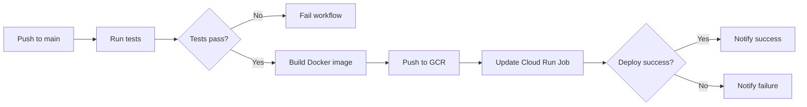

# GitHub Actions CI/CD

Automated testing and deployment workflows for the AI Newsletter Digest.

## Workflows

### `ci.yml` - Continuous Integration
**Trigger:** Push to any branch except `main`, or pull requests to `main`

**What it does:**
1. Runs unit and component tests
2. Builds Docker image to verify it compiles
3. Fails if tests fail

**Purpose:** Validate code changes before merging to main

### `deploy.yml` - Continuous Deployment
**Trigger:** Push to `main` branch, or manual trigger

**What it does:**
1. Runs all tests
2. Builds Docker image (tagged with commit SHA and `latest`)
3. Pushes to Google Container Registry
4. Updates Cloud Run Job with new image
5. Notifies deployment status

**Purpose:** Automatically deploy to production when code is pushed to main

**Note:** Deployment does not execute the job (to save API credits). The scheduled Cloud Scheduler job will run at the configured time.

## Setup

### Prerequisites

1. **Complete manual deployment first:**
   ```bash
   make setup-secrets
   make deploy
   make setup-scheduler
   ```

2. **Create GitHub Actions service account:**
   ```bash
   make setup-github-actions
   ```

   This will:
   - Create a service account: `github-actions@PROJECT_ID.iam.gserviceaccount.com`
   - Grant required permissions (Cloud Run Admin, Storage Admin, IAM Service Account User)
   - Generate a service account key: `github-actions-key.json`

### Add GitHub Secret

1. **Copy the service account key:**
   ```bash
   cat github-actions-key.json | pbcopy  # macOS
   cat github-actions-key.json           # Linux (copy output)
   ```

2. **Add to GitHub Secrets:**
   - Go to: `https://github.com/YOUR_USERNAME/maia-proj3ct/settings/secrets/actions`
   - Click "New repository secret"
   - Name: `GCP_SA_KEY`
   - Value: Paste the entire JSON key
   - Click "Add secret"

3. **Delete local key file:**
   ```bash
   rm github-actions-key.json
   ```

### Verify Setup

Push a commit to `main`:

```bash
git add .
git commit -m "Test GitHub Actions"
git push origin main
```

Check workflow status:
- Go to: `https://github.com/YOUR_USERNAME/maia-proj3ct/actions`
- You should see the "Deploy to Cloud Run" workflow running

## How It Works

### Configuration
Workflows read configuration from `config.yaml`:
- `deployment.project_id` - Google Cloud project
- `deployment.region` - Deployment region

### Image Tagging
Each deployment creates two Docker images:
- `gcr.io/PROJECT_ID/newsletter-digest:COMMIT_SHA` - Specific version
- `gcr.io/PROJECT_ID/newsletter-digest:latest` - Latest version

The Cloud Run Job uses the commit SHA tag for precise version tracking.

### Deployment Flow



## Workflows in Action

### Feature Development
```bash
git checkout -b feature/new-feature
# Make changes
git push origin feature/new-feature
```
→ Triggers `ci.yml` - Tests run, no deployment

### Merge to Main
```bash
git checkout main
git merge feature/new-feature
git push origin main
```
→ Triggers `deploy.yml` - Tests run, then deploys to Cloud Run

### Manual Deployment
Sometimes you want to re-deploy without pushing code:
- Go to: Actions → Deploy to Cloud Run → Run workflow
- Click "Run workflow" on main branch

## Troubleshooting

### "Invalid credentials" error
**Cause:** GitHub Secret `GCP_SA_KEY` is missing or invalid

**Fix:**
1. Run `make setup-github-actions` again
2. Update the `GCP_SA_KEY` secret in GitHub

### "Permission denied" errors
**Cause:** Service account lacks required permissions

**Fix:**
```bash
# Re-run setup to grant permissions
make setup-github-actions
```

### Deployment succeeds but job execution fails
**Cause:** Secrets (Gmail OAuth, Anthropic API key) not set in Secret Manager

**Fix:**
```bash
# Verify secrets exist
gcloud secrets list

# If missing, re-run:
make setup-secrets
```

### Build fails on Docker push
**Cause:** GitHub Actions service account lacks Storage Admin role

**Fix:**
```bash
PROJECT_ID=$(grep "project_id:" config.yaml | sed 's/.*project_id: *"\(.*\)".*/\1/')
SA_EMAIL="github-actions@${PROJECT_ID}.iam.gserviceaccount.com"

gcloud projects add-iam-policy-binding $PROJECT_ID \
  --member="serviceAccount:${SA_EMAIL}" \
  --role="roles/storage.admin"
```

## Security Notes

- ✅ Service account key is stored as encrypted GitHub Secret
- ✅ Key file is in `.gitignore` (never committed)
- ✅ Service account has minimal required permissions
- ✅ Separate service account for CI/CD (not user credentials)

## Disabling Auto-Deployment

To stop auto-deployment while keeping CI tests:

1. **Option 1:** Delete the workflow file
   ```bash
   git rm .github/workflows/deploy.yml
   git commit -m "Disable auto-deployment"
   git push
   ```

2. **Option 2:** Disable in GitHub UI
   - Go to Actions → Deploy to Cloud Run → ⋯ → Disable workflow

Manual deployments will still work with `make deploy`.
